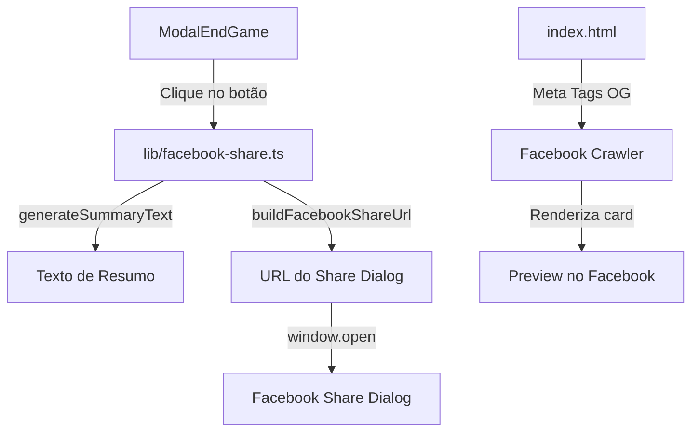

# Documento de Design — Compartilhar Resultado no Facebook

## Visão Geral

Esta funcionalidade adiciona um botão "Compartilhar no Facebook" ao componente `ModalEndGame`, permitindo que o jogador compartilhe o resultado do jogo na sua timeline do Facebook. A implementação utiliza o endpoint `sharer.php` do Facebook (Share Dialog), que não requer autenticação OAuth nem Facebook App ID.

### Decisões de Design

1. **Sem SDK do Facebook**: Utilizamos a URL `https://www.facebook.com/sharer/sharer.php` diretamente via `window.open`, evitando dependências externas e scripts de terceiros.
2. **Parâmetro `quote` descontinuado**: A pesquisa revelou que o Facebook descontinuou o parâmetro `quote` do sharer.php em meados de 2022. O conteúdo do card de pré-visualização é extraído exclusivamente das meta tags Open Graph da página compartilhada. Ainda assim, incluímos o parâmetro `quote` na URL conforme especificado nos requisitos — ele não causa erros, apenas não é exibido pelo Facebook.
3. **Função utilitária pura**: A lógica de construção da URL e geração do texto de resumo é isolada em funções puras no módulo `lib/facebook-share.ts`, facilitando testes e reutilização.
4. **Meta tags estáticas**: As meta tags Open Graph são adicionadas diretamente no `index.html`, pois o conteúdo é estático (não varia por partida).

## Arquitetura

A funcionalidade é composta por três camadas:



### Fluxo de Dados

1. O jogador vence o jogo → `ModalEndGame` é aberto com o grafo do resultado
2. O componente gera o texto de resumo a partir do caminho do jogo via `generateSummaryText()`
3. Ao clicar no botão, `buildFacebookShareUrl()` constrói a URL completa
4. `window.open()` abre o Facebook Share Dialog em uma nova janela
5. O Facebook faz crawl da URL compartilhada e renderiza o card usando as meta tags OG

## Componentes e Interfaces

### 1. Módulo `lib/facebook-share.ts`

Novo módulo com duas funções puras exportadas:

```typescript
// Tipos
interface GameNode {
  name: string;
  type: "ator" | "novela";
}

// Gera o texto de resumo do resultado do jogo
export function generateSummaryText(nodes: GameNode[]): string;

// Constrói a URL completa do Facebook Share Dialog
export function buildFacebookShareUrl(quote: string, shareUrl: string): string;
```

**`generateSummaryText(nodes)`**:
- Recebe o array de nós do caminho do jogo
- Extrai o primeiro e último ator (nós nas posições 0 e `length - 1`)
- Calcula o número de passos: `(nodes.length - 1) / 2` (cada passo é ator→novela→ator)
- Formata: `"Conectei [Ator A] ao [Ator B] em [N] passo(s): [A] → [X] → [C] → ... → [B]"`
- Usa "passo" (singular) quando N === 1, "passos" (plural) caso contrário

**`buildFacebookShareUrl(quote, shareUrl)`**:
- Base URL: `https://www.facebook.com/sharer/sharer.php`
- Parâmetros: `u` (URL codificada) e `quote` (texto codificado)
- Utiliza `encodeURIComponent()` para codificar ambos os parâmetros
- Retorna a URL completa como string

### 2. Componente `ModalEndGame` (modificação)

Alterações no componente existente:

- Importa `generateSummaryText` e `buildFacebookShareUrl` de `lib/facebook-share.ts`
- Adiciona o botão "Compartilhar no Facebook" ao lado do botão "Fechar"
- O botão só é renderizado quando `graph?.found === true` e `graph?.nodes?.length >= 3`
- Ao clicar, chama `window.open()` com a URL construída por `buildFacebookShareUrl()`
- Dimensões da popup: `width=600, height=400`

```typescript
// Dentro do ModalEndGame, no handler de clique:
const handleShare = useCallback(() => {
  const summaryText = generateSummaryText(graph.nodes);
  const shareUrl = buildFacebookShareUrl(summaryText, GAME_URL);
  window.open(shareUrl, '_blank', 'width=600,height=400');
}, [graph]);
```

### 3. `index.html` (modificação)

Adição de meta tags Open Graph no `<head>`:

```html
<meta property="og:title" content="Conecte os Globais" />
<meta property="og:description" content="Conecte atores da Globo através de suas novelas! Um jogo inspirado nos Seis Graus de Separação." />
<meta property="og:image" content="https://conecteosglobais.igormarcelo.dev.br/grade-globo.png" />
<meta property="og:url" content="https://conecteosglobais.igormarcelo.dev.br/" />
<meta property="og:type" content="website" />
```

## Modelos de Dados

### Tipos existentes (sem alteração)

O componente `ModalEndGame` já recebe a prop `graph` com a interface:

```typescript
interface Graph {
  grau?: number;
  nodes?: GameNode[];
  found?: boolean;
}
```

### Novo tipo exportado

```typescript
// Em lib/facebook-share.ts
export interface GameNode {
  name: string;
  type: "ator" | "novela";
}
```

### Constante

```typescript
// Em lib/facebook-share.ts
export const GAME_URL = "https://conecteosglobais.igormarcelo.dev.br/";
```

## Propriedades de Corretude

*Uma propriedade é uma característica ou comportamento que deve ser verdadeiro em todas as execuções válidas de um sistema — essencialmente, uma declaração formal sobre o que o sistema deve fazer. Propriedades servem como ponte entre especificações legíveis por humanos e garantias de corretude verificáveis por máquina.*

### Propriedade 1: Geração do texto de resumo preserva informações do caminho

*Para qualquer* caminho de jogo válido (array de nós alternando entre atores e novelas, com pelo menos 3 nós), a função `generateSummaryText` SHALL produzir um texto que:
- Contém o nome do primeiro ator e do último ator
- Contém todos os nomes de nós intermediários na ordem correta, separados por " → "
- Indica o número correto de passos (arestas entre atores, calculado como `(nodes.length - 1) / 2`)
- Usa "passo" (singular) quando há exatamente 1 passo, e "passos" (plural) caso contrário

**Valida: Requisitos 1.1, 1.2, 1.3**

### Propriedade 2: Round-trip de codificação/decodificação da URL de compartilhamento

*Para qualquer* texto de resumo válido (incluindo caracteres especiais, acentos, emojis e setas "→") e qualquer URL de compartilhamento válida, construir a URL do Facebook Share Dialog via `buildFacebookShareUrl` e depois extrair e decodificar os parâmetros `u` e `quote` da URL resultante SHALL produzir os valores originais.

**Valida: Requisitos 5.2, 5.3, 5.4**

## Tratamento de Erros

| Cenário | Comportamento |
|---------|---------------|
| `graph` é `undefined` ou `graph.found` é `false` | Botão de compartilhar não é renderizado |
| `graph.nodes` é `undefined` ou tem menos de 3 elementos | Botão de compartilhar não é renderizado |
| `window.open` é bloqueado por popup blocker | Nenhum tratamento especial — comportamento padrão do navegador |
| Caracteres especiais no texto de resumo | `encodeURIComponent` trata automaticamente |

Não há necessidade de tratamento de erros complexo pois:
- As funções utilitárias são puras e não fazem I/O
- O `window.open` é fire-and-forget (não precisamos do resultado)
- A renderização condicional do botão previne estados inválidos

## Estratégia de Testes

### Abordagem Dual

A estratégia combina testes unitários (exemplos específicos) com testes baseados em propriedades (verificação universal):

### Testes Baseados em Propriedades (fast-check)

**Biblioteca**: `fast-check` (biblioteca PBT para TypeScript/JavaScript)

Cada teste de propriedade deve rodar no mínimo 100 iterações.

| Propriedade | Arquivo de Teste | Tag |
|-------------|-----------------|-----|
| Propriedade 1: Geração do texto de resumo | `tests/lib/facebook-share.test.ts` | Feature: facebook-share-endgame, Property 1: Summary text generation preserves path information |
| Propriedade 2: Round-trip de URL | `tests/lib/facebook-share.test.ts` | Feature: facebook-share-endgame, Property 2: URL encoding/decoding round-trip |

### Testes Unitários (Vitest + React Testing Library)

| Teste | Arquivo | Tipo |
|-------|---------|------|
| Botão renderizado com dados válidos | `tests/components/ModalEndGame.test.tsx` | EXAMPLE |
| Botão oculto sem dados válidos | `tests/components/ModalEndGame.test.tsx` | EXAMPLE |
| Clique chama `window.open` com URL correta | `tests/components/ModalEndGame.test.tsx` | EXAMPLE |
| Texto singular "1 passo" | `tests/lib/facebook-share.test.ts` | EDGE_CASE |
| Texto plural "N passos" | `tests/lib/facebook-share.test.ts` | EDGE_CASE |
| URL contém parâmetro `u` correto | `tests/lib/facebook-share.test.ts` | EXAMPLE |
| URL contém parâmetro `quote` correto | `tests/lib/facebook-share.test.ts` | EXAMPLE |
| Meta tags OG presentes no index.html | Verificação manual / CI | SMOKE |

### Dependência de Teste

- **Nova dependência dev**: `fast-check` para testes baseados em propriedades
- **Frameworks existentes**: Vitest + React Testing Library + jsdom (já configurados)
