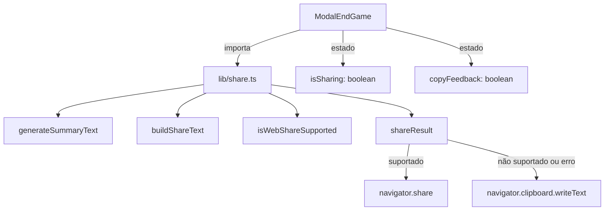

# Design — Web Share API para Compartilhamento de Resultados

## Overview

Esta feature substitui o compartilhamento via Facebook Share Dialog (`sharer.php`) pela Web Share API nativa do navegador. A mudança é motivada pela descontinuação do parâmetro `quote` no `sharer.php` pelo Facebook, que impedia a exibição do texto de resumo do jogo.

A nova abordagem usa `navigator.share` para compartilhar texto + URL com qualquer aplicativo instalado no dispositivo do usuário. Quando a Web Share API não está disponível, o sistema copia o texto para a área de transferência como fallback.

### Decisões de Design

1. **Módulo `lib/share.ts` substitui `lib/facebook-share.ts`**: O novo módulo mantém `generateSummaryText`, `GameNode` e `GAME_URL` inalterados, remove `buildFacebookShareUrl`, e adiciona `isWebShareSupported()`, `shareResult()` e `buildShareText()`.
2. **Funções puras + uma função com side-effects**: `buildShareText` e `isWebShareSupported` são funções puras/determinísticas. `shareResult` encapsula os side-effects (chamada a `navigator.share` e `navigator.clipboard.writeText`).
3. **Fallback em cascata**: Web Share API → Clipboard API → mensagem de erro. O fallback para clipboard também é acionado quando `navigator.share` falha com erro diferente de `AbortError`.
4. **Estado no componente**: O `ModalEndGame` gerencia estados `isSharing` (para desabilitar o botão) e `copyFeedback` (para exibir "Copiado!" por 2 segundos) via `useState`.

## Architecture



A arquitetura é simples e direta:

- **`lib/share.ts`**: Módulo utilitário que exporta funções puras (`generateSummaryText`, `buildShareText`, `isWebShareSupported`) e uma função com side-effects (`shareResult`).
- **`ModalEndGame.tsx`**: Componente React que consome o módulo `share.ts`, gerencia estados de UI e renderiza o botão de compartilhamento.

Não há mudanças na arquitetura geral do frontend — apenas substituição de um módulo utilitário e atualização de um componente.

## Components and Interfaces

### `lib/share.ts` — Share Module

```typescript
// Preservados do módulo anterior (sem alterações)
export interface GameNode {
  name: string;
  type: "ator" | "novela";
}

export const GAME_URL = "https://conecteosglobais.igormarcelo.dev.br/";

export function generateSummaryText(nodes: GameNode[]): string;

// Novas funções
export function isWebShareSupported(): boolean;

export function buildShareText(summaryText: string, url: string): string;

export type ShareResultOutcome =
  | { status: "shared" }
  | { status: "copied" }
  | { status: "error"; message: string };

export async function shareResult(nodes: GameNode[]): Promise<ShareResultOutcome>;
```

#### `isWebShareSupported()`

Verifica se `navigator.share` está disponível e é uma função. Retorna `true` ou `false`. Trata o caso em que `navigator` não está definido (SSR).

#### `buildShareText(summaryText, url)`

Função pura que concatena o texto de resumo e a URL no formato:
```
{summaryText}\n{url}
```

#### `shareResult(nodes)`

Função assíncrona que orquestra o fluxo de compartilhamento:

1. Gera o texto de resumo via `generateSummaryText(nodes)`.
2. Se `isWebShareSupported()` retorna `true`:
   - Chama `navigator.share({ title: "Conecte os Globais", text: summaryText, url: GAME_URL })`.
   - Se sucesso, retorna `{ status: "shared" }`.
   - Se `AbortError`, retorna `{ status: "shared" }` (cancelamento silencioso).
   - Se outro erro, faz fallback para clipboard.
3. Se Web Share API não disponível, faz fallback para clipboard:
   - Chama `navigator.clipboard.writeText(buildShareText(summaryText, GAME_URL))`.
   - Se sucesso, retorna `{ status: "copied" }`.
   - Se erro, retorna `{ status: "error", message: "Não foi possível copiar o texto." }`.

### `ModalEndGame.tsx` — Alterações

```typescript
// Novos imports
import { generateSummaryText, shareResult, GAME_URL } from '../lib/share';

// Novos estados
const [isSharing, setIsSharing] = useState(false);
const [copyFeedback, setCopyFeedback] = useState(false);

// Novo handler
const handleShare = useCallback(async () => {
  setIsSharing(true);
  try {
    const result = await shareResult(graph!.nodes);
    if (result.status === "copied") {
      setCopyFeedback(true);
      setTimeout(() => setCopyFeedback(false), 2000);
    }
    // result.status === "error" → exibir mensagem de erro (toast ou inline)
  } finally {
    setIsSharing(false);
  }
}, [graph]);

// Botão atualizado
<Button onClick={handleShare} disabled={isSharing}>
  {copyFeedback ? "Copiado!" : "Compartilhar"}
</Button>
```

## Data Models

### `GameNode` (preservado)

```typescript
interface GameNode {
  name: string;
  type: "ator" | "novela";
}
```

Nenhum modelo de dados novo é necessário. A interface `GameNode` e a constante `GAME_URL` são preservadas do módulo anterior.

### `ShareResultOutcome` (novo)

```typescript
type ShareResultOutcome =
  | { status: "shared" }
  | { status: "copied" }
  | { status: "error"; message: string };
```

Union type discriminada que representa os três resultados possíveis do fluxo de compartilhamento. Permite ao componente reagir de forma tipada a cada cenário.


## Correctness Properties

*A property is a characteristic or behavior that should hold true across all valid executions of a system — essentially, a formal statement about what the system should do. Properties serve as the bridge between human-readable specifications and machine-verifiable correctness guarantees.*

### Avaliação de Aplicabilidade de PBT

Esta feature contém funções puras com comportamento claro de entrada/saída (`generateSummaryText`, `buildShareText`) que são boas candidatas para property-based testing. As funções com side-effects (`shareResult`, `isWebShareSupported`) são melhor testadas com testes de exemplo usando mocks.

### Property 1: generateSummaryText preserva informações do caminho

*For any* valid game path (alternating ator/novela nodes, minimum 3 nodes, starting and ending with "ator"), the summary text generated by `generateSummaryText` SHALL:
- Contain all node names in the correct order separated by " → "
- Contain the correct step count `(nodes.length - 1) / 2`
- Use "passo" (singular) when steps === 1, "passos" (plural) otherwise
- Start with "Conectei {firstActor} ao {lastActor}"

**Validates: Requirements 1.1, 1.2, 1.3**

### Property 2: buildShareText round-trip (composição/decomposição)

*For any* valid summary text (non-empty, without newlines) and valid URL (non-empty, without newlines), building the share text with `buildShareText(summaryText, url)` and then splitting the result by `"\n"` SHALL produce exactly two parts where `parts[0] === summaryText` and `parts[1] === url`.

**Validates: Requirements 7.1, 7.2**

## Error Handling

| Cenário | Comportamento | Resultado |
|---------|---------------|-----------|
| `navigator.share` lança `AbortError` | Tratamento silencioso — usuário cancelou o diálogo | `{ status: "shared" }` |
| `navigator.share` lança outro erro | Fallback para clipboard | Tenta `clipboard.writeText` |
| `navigator.clipboard.writeText` sucesso | Texto copiado | `{ status: "copied" }` |
| `navigator.clipboard.writeText` falha | Mensagem de erro | `{ status: "error", message: "..." }` |
| `navigator` não definido (SSR) | `isWebShareSupported()` retorna `false` | Fallback para clipboard |
| `graph` undefined ou inválido | Botão de compartilhar não renderizado | Nenhuma ação |

A função `shareResult` nunca lança exceções — todos os erros são capturados e retornados como `ShareResultOutcome` com `status: "error"`. Isso permite ao componente tratar erros de forma declarativa sem `try/catch`.

## Testing Strategy

### Abordagem Dual: Testes de Exemplo + Testes de Propriedade

O projeto já usa **Vitest** como framework de testes e **fast-check** para property-based testing (ambos já instalados em `package.json`).

### Testes de Propriedade (Property-Based Tests)

Cada propriedade do design será implementada como um teste property-based com **fast-check**, com mínimo de 100 iterações.

| Property | Função Testada | Tag |
|----------|---------------|-----|
| Property 1 | `generateSummaryText` | Feature: web-share-api, Property 1: generateSummaryText preserves path information |
| Property 2 | `buildShareText` | Feature: web-share-api, Property 2: buildShareText round-trip |

**Nota**: A Property 1 já existe nos testes atuais (`facebook-share.test.ts`). Ela será migrada para o novo arquivo de testes `share.test.ts` sem alterações na lógica do teste, apenas atualizando os imports.

### Testes de Exemplo (Unit Tests)

| Área | Cenários |
|------|----------|
| `isWebShareSupported` | `navigator.share` presente → `true`; ausente → `false`; `navigator` undefined → `false` |
| `shareResult` (Web Share) | Chamada com mock de `navigator.share` → verifica parâmetros (`title`, `text`, `url`) |
| `shareResult` (AbortError) | Mock rejeita com `AbortError` → retorna `{ status: "shared" }` |
| `shareResult` (erro genérico) | Mock rejeita com `Error` → fallback para clipboard |
| `shareResult` (clipboard) | `navigator.share` indisponível → `clipboard.writeText` chamado com texto correto |
| `shareResult` (clipboard falha) | `clipboard.writeText` rejeita → retorna `{ status: "error" }` |
| `ModalEndGame` (botão) | Renderiza "Compartilhar" quando `graph.found === true` e `nodes.length >= 3` |
| `ModalEndGame` (oculto) | Não renderiza botão quando `graph.found === false` ou `nodes.length < 3` |
| `ModalEndGame` (disabled) | Botão desabilitado durante compartilhamento |
| `ModalEndGame` (feedback) | Exibe "Copiado!" por 2 segundos após cópia para clipboard |

### Arquivos de Teste

| Arquivo | Conteúdo |
|---------|----------|
| `frontend/src/tests/lib/share.test.ts` | Testes de `generateSummaryText`, `buildShareText`, `isWebShareSupported`, `shareResult` + PBTs |
| `frontend/src/tests/components/ModalEndGame.test.tsx` | Testes atualizados do componente (novo texto do botão, novo comportamento) |

### Migração de Testes

- O arquivo `frontend/src/tests/lib/facebook-share.test.ts` será substituído por `frontend/src/tests/lib/share.test.ts`.
- Os testes de `generateSummaryText` e a Property 1 serão migrados com imports atualizados.
- Os testes de `buildFacebookShareUrl` e a Property 2 (round-trip de URL encoding) serão removidos e substituídos pela nova Property 2 (round-trip de `buildShareText`).
- Os testes de `ModalEndGame.test.tsx` serão atualizados para refletir o novo texto do botão ("Compartilhar") e o novo comportamento de compartilhamento.
